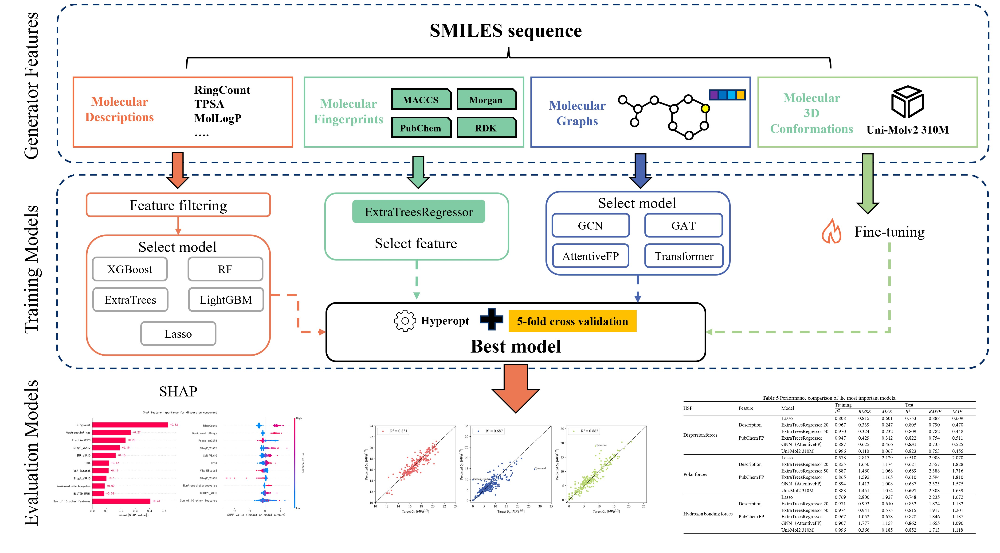

# **Enhanced Prediction of Hansen Solubility Parameters via Graph Neural Networks and Fine-tuned Uni-Mol**

## Project Overview

Using three features—molecular descriptors, molecular fingerprints, and molecular graphs—combined with machine learning and GNNs to predict HSPs.

The research work is as follows:

1. Using RDKit to generate 2D/3D molecular descriptors, we selected the XGBoost, LightGBM, RF, and ExtraTreesRegressor models for HSPs prediction. We then used the SHAP method to analyze the feature influence of the descriptors.
2. The performance of four fingerprints (Morgan, PubChem, RDKit, and MACCS) was compared, and the best model (PubChem-ExtraTreesRegressor) was selected for SHAP analysis to analyze the feature influence of molecular substructures.
3. Based on molecular graph features, GCN, GAT, AttentiveFP, and Transformer were used for end-to-end prediction of HSPs.
4. Fine-tune the Uni-Mol pre-trained model to predict HSPs.

## Environment Requirements

`Python 3.8`、`cuda 11.8`、`PyTorch 2.2.2`、`PyG 2.5.2`、`RDKit 2024.3.5`、`PyBioMed`、`Scikit-learn`、`Pandas`、`Numpy`、`Chemprop`、`Uni-Mol tools`、`Hyperopt`、`XGBoost`

## Data

The Dataset folder contains the required training set, test set, and external data set, named `train_data.xlsx`, `test_data.xlsx`, and `data_out_feats.xlsx`.

## Execution Instructions

All scripts are executed by Jupyter.

Features folder： The Features folder contains detailed code for feature selection.

Models folder: The Features folder contains descriptors, fingerprints, GNN, and Uni-Mol modeling code.

Utils folder: The Features folder contains a tool library for feature generation.

## Notes

- The GNN checkpoint has been saved as `ATT_X.pth` and can be run directly in `Predict_X.ipynb`.
- Using the Uni-Mol model requires downloading the fine-tuned model from Hugging Face. To use the Uni-Mol model, you need to download the fine-tuned model from Hugging Face, then rename the downloaded model to `model_0.pth` and save it in a directory such as `Models/Unimol/D/exp`.

[chunfenghuayu/HSP-Model · Hugging Face](https://huggingface.co/chunfenghuayu/HSP-Model)
